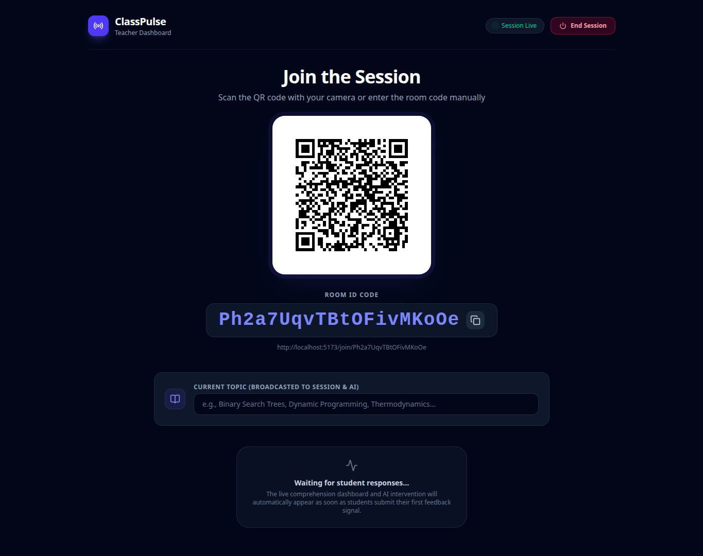
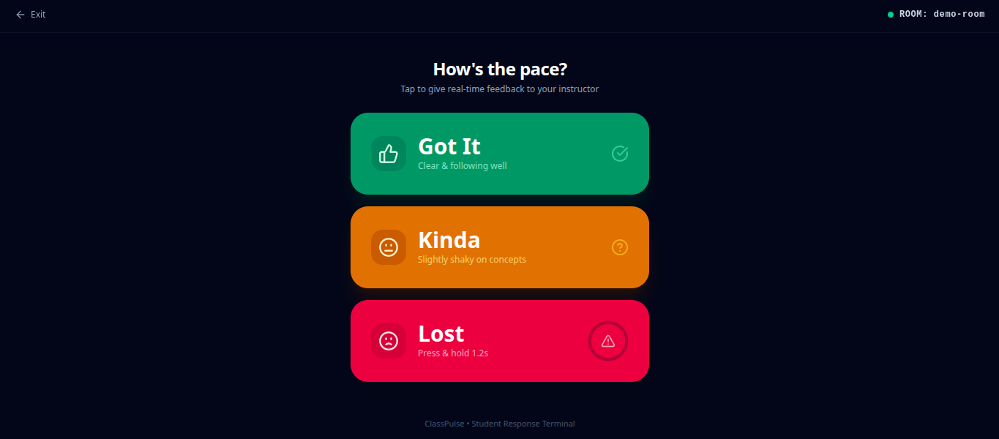
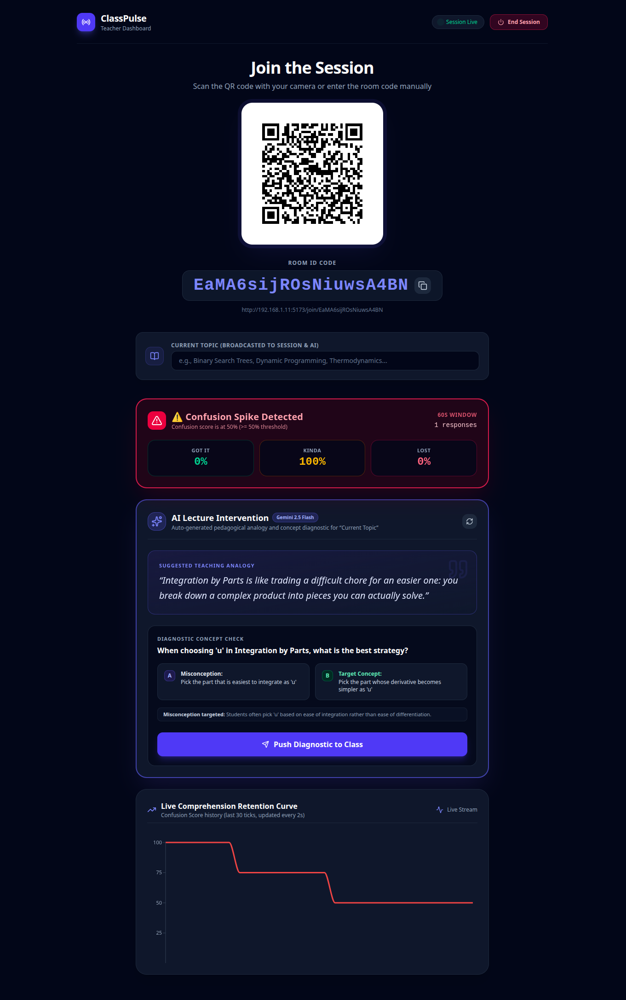

# 📡 ClassPulse

**Real-time classroom confusion detection & AI-powered adaptive teaching support.**

[Live Demo](#) · [Report an Issue](#)

---

## The Problem

Teachers ask "does everyone understand?" and get met with silence — not because students understand, but because nobody wants to be the one who admits they're lost. Confusion compounds silently for the rest of the class, and the teacher only finds out when homework or exam results come back, days or weeks later. By then, the moment to actually fix it is long gone.

## The Solution

ClassPulse turns silent classroom confusion into a live, anonymous feedback signal the teacher can act on **in the moment**, not after the exam.

- Students tap **Got It / Kinda / Lost** on their phones during the lecture — completely anonymous.
- The teacher sees a **live comprehension graph**, updating in real time as the class responds.
- If confusion spikes past a threshold, **Gemini AI instantly generates** a simple analogy and a 2-option diagnostic question targeting the exact misconception.
- The teacher pushes it to every student's phone with one click, gets an instant read on exactly where the class is stuck, and can adjust the lecture on the spot.

## Features

- 🔗 **Zero-friction onboarding** — students join via QR code, no login or app download required
- 📊 **Live retention curve** — a real-time graph of class-wide comprehension, powered by a 60-second sliding window
- ✋ **Hold-to-confirm "Lost" button** — prevents spam taps and trolling, ensures intentional, clean signal data
- 🤖 **AI-generated interventions** — Gemini creates a teaching analogy and a targeted A/B diagnostic question the instant confusion spikes
- ⚡ **Instant push to class** — one click sends the diagnostic question live to every connected student device
- 📈 **Post-class summary** — a session heatmap showing exactly which moments/topics caused the most confusion

## Tech Stack

| Layer | Tech |
|---|---|
| Frontend | React (Vite) + Tailwind CSS + Recharts + Lucide Icons |
| Backend / Server | Node.js + Express + Server-Sent Events (SSE) |
| Database | **Zero-Config Local JSON Database** (`data/sessions.json`) or **Optional Firebase Firestore** |
| AI | Gemini API (server-side proxy `/api/intervention` with topic fallbacks) |
| Architecture | Full-Stack Client + Server (port 3000) |

## Screenshots





## Database & Deployment Modes

This fork is designed for maximum flexibility, especially during **hackathons, live judging, and classroom demos**:

1. **Local Server JSON Mode (Default — Zero-Config)**
   - No database accounts or cloud API keys required.
   - All session states, confusion signals, and diagnostic responses persist server-side in `data/sessions.json`.
   - Real-time cross-device sync is powered by **Server-Sent Events (SSE)**.
   - Students scanning the QR code on physical mobile phones communicate with the teacher's laptop in real time out of the box.
   - If `GEMINI_API_KEY` is not provided, the server uses a built-in educational fallback generator for common curriculum topics (recursion, photosynthesis, Newton's laws, binary search, calculus).

2. **Optional Firebase Cloud Mode**
   - If you prefer cloud-hosted persistence across distributed deployments, set `VITE_STORAGE_MODE=firebase` in `.env` along with your Firebase credentials.
   - The app seamlessly routes all reads, writes, and real-time listeners through Google Cloud Firestore.

## How It Works

1. Teacher opens the app and a session QR code is generated instantly.
2. Students scan the QR code from their mobile devices and land directly on the response screen — no setup or app install.
3. As the lecture proceeds, students tap their comprehension level; signals sync instantly via SSE or Firestore.
4. A sliding-window algorithm continuously aggregates the last 60 seconds of responses into a live confusion score.
5. When confusion crosses the threshold (>= 50), Gemini AI generates an analogy + targeted A/B diagnostic question for the topic.
6. The teacher pushes it live to connected student devices with one click, diagnoses the exact misconception, and adjusts the lecture on the spot.

## Getting Started (Run Locally)

```bash
# Clone the repo
git clone https://github.com/hemanth1914-stack/Class-Pulse.git
cd Class-Pulse

# Install dependencies
npm install

# (Optional) Set up environment variables
cp .env.example .env

# Run the full-stack server (binds to http://localhost:3000)
npm run dev
```

> **Note for Hackathon Demos:** The app runs immediately with **zero configuration** using the default local JSON database!

## Production Build & Start

```bash
# Build client and bundle backend server
npm run build

# Launch production server
npm start
```

## Environment Variables

Create a `.env` file in the root directory (see `.env.example`):

```env
# Server-side Gemini AI Key (Optional - includes built-in offline educational fallbacks)
GEMINI_API_KEY=

# Storage Mode: 'json' (default local server database) or 'firebase' (optional cloud sync)
VITE_STORAGE_MODE=json

# Optional: Firebase configuration (only required if VITE_STORAGE_MODE=firebase)
VITE_FIREBASE_API_KEY=
VITE_FIREBASE_AUTH_DOMAIN=
VITE_FIREBASE_PROJECT_ID=
VITE_FIREBASE_STORAGE_BUCKET=
VITE_FIREBASE_MESSAGING_SENDER_ID=
VITE_FIREBASE_APP_ID=
```


## License

This project is licensed under the MIT License — see the [LICENSE](./LICENSE) file for details.
